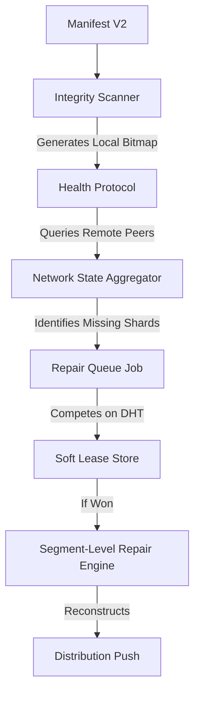
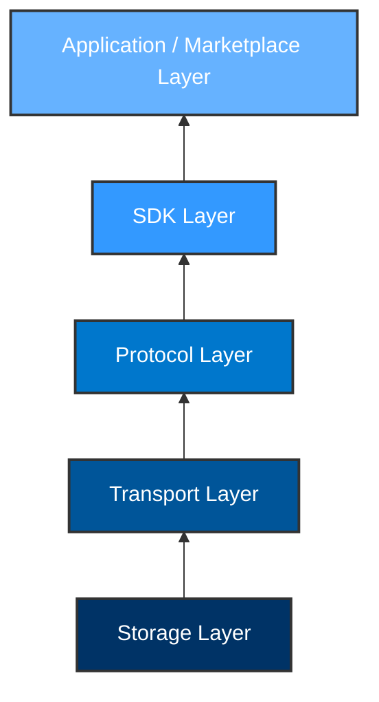
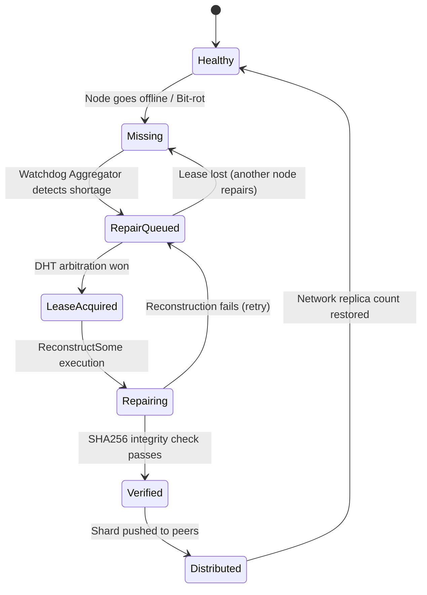

# MeshWeb Architecture

This document outlines the core architecture of the MeshWeb Protocol (V1).

## 1. Component Architecture Flow

The self-healing pipeline relies on a strict, decoupled flow of operations:



## 2. Layer Diagram

MeshWeb is designed with strict separation of concerns, ensuring that high-level economic or application requirements do not leak into the storage foundations.


- **Storage Layer**: Erasure coding (`klauspost/reedsolomon`), local disk I/O, hash verification.
- **Transport Layer**: libp2p (Streams, DHT, Gossip).
- **Protocol Layer**: Watchdog Daemon, Repair Pipeline, Health Endpoints, Manifest Specs.
- **SDK Layer**: Golang libraries wrapping the protocol logic.
- **Application Layer**: MeshWeb GUI, Storage Economy, Tokens, User accounts.

## 3. State Machine (File / Shard Lifecycle)



## 4. Future Repository Layout (Post V1)

> Repository restructuring is intentionally deferred until after Protocol V1 freeze to minimize churn and preserve git history during stabilization.

Once the protocol is absolutely stable, the repository will migrate to the following structure:
```text
meshweb/
    protocol/    # Core V1 specs and engines (erasure, watchdog)
    daemon/      # Headless node runner 
    sdk/         # Go SDK for client apps
    cli/         # Command line interface
    examples/    # Sample code
    docs/        # Architecture & Specs
```
